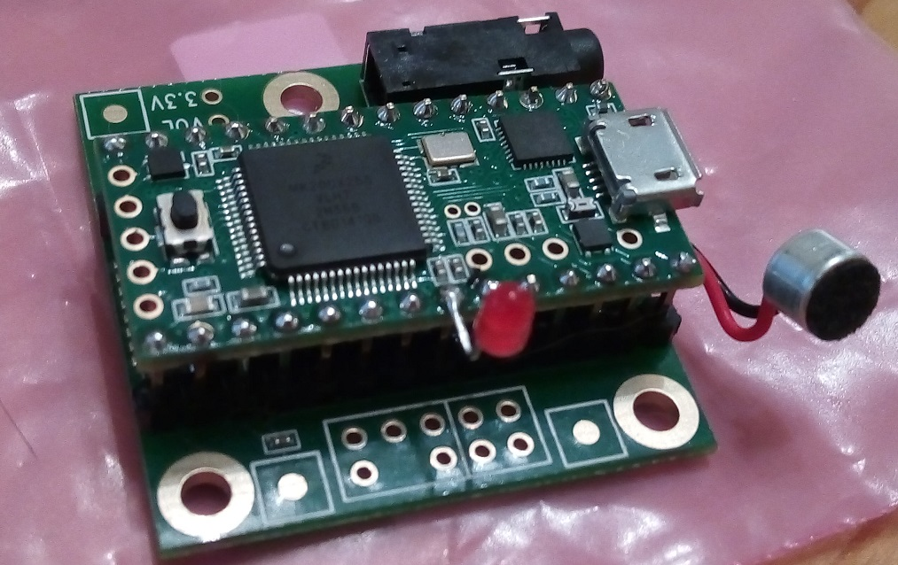

This project aims at creating a remote control that can be activated by whistling. The final goal is to be able to have a device that can be trained for an arbitrary whistled tune and should react only to that. Eventually the project will explore also different, non musical, whistling sequences such as whistles with certain intervals or ascending/descending patterns to provide different forms of control. 

Hardware
===========

The hardware is a Teensy 3.1, which is running an ARM Cortex M4 processor, and its companion audio board that sports a SGTL5000 chip that takes care to handle the analog signal input as well as provides a software controllable microphone pre-amp.

Release 0.1
===========

This is the very first iteration and it just makes use of the Teensy 3.1 Audio library FFT implementation to implement a simple detector of two tones whistles. We define one tone as LOW (860Hz) and HIGH (1290Hz). The frequencies were empirically determined as confortable for me to whistle as there is no training in this iteration. Since the tones to recognize are only two at the moment it would have been appropriate also to apply Goertzel, which is also ready implemented in the Teensy Audio libraries as a tone detector. This version simply recognizes the pattern "LH" and sets the LED on and the pattern "HL" and sets the LED off.

This is a quite intuitive way to control the LED (try to whistle low-high and high-low and you will feel the association to on and off respectively quite easily).

See a video of the device in action at https://www.youtube.com/watch?v=cjvEFRKRVuU

Release 0.2
===========

This is the second iteration that is able to learn a whistled melody and recognize it. I have also added, purely for fun, vocal feedback to guide the user in the various steps. The current firmware learns one whistle tune 

